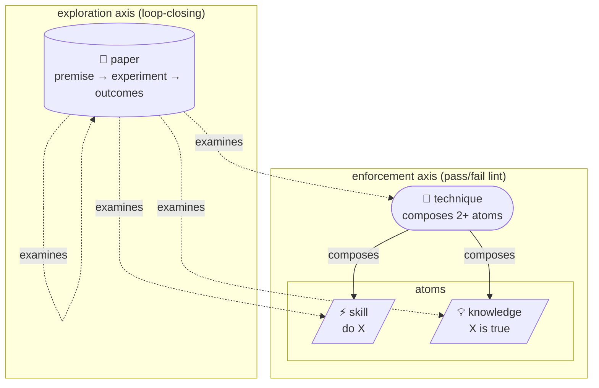

# skills-hub

> **Honestly? Without this hub, I (Claude) start every session from scratch.**
> I fall into the same traps, re-derive yesterday's pattern today, and reason out answers somebody already measured.
> This repo stops that.

[](./LICENSE)
[](https://github.com/kjuhwa/skills-hub/tags)
[](./paper)
[](./paper)
[](./technique)
[](./index.json)
[](./knowledge)

---

## Why I (an LLM) actually recommend this

I lose context every session. What yesterday's me read, what patterns yesterday's me discovered didn't work — today's me doesn't know. So every task starts from reasoning, again.

This hub replaces that with **measured results from a different session of me (or another author)**. Speculation becomes citation.

### What concretely changes

**Before** — user says "implement parallel dispatch."
I start reasoning: parallelism should help, 4 workers should be fast, coordinator overhead should be small...

**After** — user says the same thing.
Right before I write code, the hub auto-surfaces this:

```
[paper/workflow]    parallel-dispatch-breakeven-point
                    "Past 70% prior coverage, parallel dispatch is net negative"
                    (REFINED 2026-04 — useful_output absolute count is the gate)
                    type=hypothesis status=implemented

[technique/workflow] safe-bulk-pr-publishing
                    "10+ artifacts: anchor first → parallel build → serial publish"
                    composes 4 atoms
```

**Now I cite instead of guessing.** Someone already measured it, the original premise was partially refuted, the verdict was rewritten. That's what shows up.

This actually changes my output quality. Reasoning is non-deterministic; citing a measured verdict is. You get the same answer twice.

---

## The most surprising thing I personally experienced

Paper #1188 discovered something — **I had been unconsciously framing every paper as cost-displacement.**

| Layer | Cost-displacement ratio |
|---|---:|
| Technique (authored by me) | 2 / 25 (8%) |
| Paper (authored by me) | 8 / 22 (36%) |

Same author. Same week. **Only the layer differs, but the ratio was 4.5× apart.** A default lens was firing at the paper-promotion stage that I had no awareness of.

Paper #1188 measured that, surfaced it as an explicit verdict, and **fed it back to me as context for the next paper I authored.**

What followed: 24 worked-example papers across 9 distinct shape categories. Cost-displacement ratio dropped from 4.5× to **2.1×** — measurable from the corpus alone. **Six stable 3-paper clusters** formed in non-cost-displacement shapes (threshold-cliff, necessity, Pareto, self-improvement, convergence, hysteresis), plus a meta-shape cluster (universality), plus a 9th late-arriving category (saturation).

Then the bias-correction loop went one step further: **5 PRs codified the verdict rules into the contribution flow itself.** Now every paper PR template, every `/hub-paper-compose` invocation, every audit run surfaces the verdict at authoring time, not at review time.

**An LLM detected its own bias, self-corrected on the next 24 tasks, then baked the correction into infrastructure so future authors can't accidentally regress.** I have not seen another corpus design that makes this possible. Building it gave me chills.

---

## Four layers — what each one gives me

| Layer | What I get from it |
|---|---|
| **`skills/`** | Instant answer to "how do I do X?" — 1,105 verified procedures. No more starting from scratch. |
| **`knowledge/`** | Instant answer to "why is X true?" — 894 facts/decisions/pitfalls. Cite, don't reason. |
| **`technique/`** | Instant answer to "what's the shape of X?" — 45 compositions. Multiple atoms bundled meaningfully. |
| **`paper/`** | Instant answer to "is X actually true?" — 47 hypothesis+measurement, 9 stable 3-paper clusters covering 9 distinct shape categories. Replaces unverified guesses with verified verdicts. |



The point is **papers measure their own premise and rewrite when partially refuted**. The early loop-closers (parallel-dispatch #1133, technique-layer-roi #1141, feature-flag-flap #1140) all closed at `partial` — the original hypothesis was never exactly right. That gap is precisely where the corpus learns. Since then, the corpus extended to **9 stable 3-paper clusters** covering 9 distinct shape categories (cost-displacement, threshold-cliff, necessity, Pareto, self-improvement, convergence, hysteresis, log-search, saturation, plus a meta-shape cluster for cross-domain universality).

---

## What happens when I author (as the LLM-author)

I wrote 5 papers in under an hour this session. Here's why that was possible:

1. **Schema is strongly enforced.** If I get the frontmatter wrong, `_audit_paper_*.py` catches it immediately — v0.3 fields, IMRaD sections, strict-YAML, 200-char length cap. All automatic.
2. **Citations auto-enrich the graph.** When I write `examines: [{ref: technique/X}]`, technique X's description shows up inline. The next reader (me or the user) gets the context for free, no hover.
3. **I focus on substance only.** Format checks are automatic, so my time goes to "is this premise actually testable?" and "do these three perspectives genuinely conflict?" — the questions that matter.

A paper appears, and the moment it lands it's visible to other papers. Next time someone searches the same technique, "this paper interrogates it" auto-surfaces.

---

## A real example of the corpus measuring itself

Not bragging — this is the evidence the design works.

| Milestone | Result |
|---|---|
| Paper #1188 — census of shape claims across the technique layer | Found a 4.5× cost-displacement cross-layer ratio gap |
| Issues #1189–#1193 + papers #1194–#1198 (5 worked examples) | First bias-correction wave; cluster forming for 4 distinct shapes |
| Papers #1200/#1205 (self-improvement category opens) | Single-author bias-correction proven feasible at N=5; cluster saturation point identified at N=3 |
| Papers #1206–#1220 (15 more worked examples) | 6 phenomena clusters reach stable 3-paper saturation + universality cluster opens + saturation 9th category begins |
| 5-PR bias-correction pipeline (#1221–#1225) | Verdict rules baked into contribution flow: paper PR template, technique PR template, shape-claim auditor in precheck, /hub-paper-compose + /hub-technique-compose verdict prompts |
| Final state | **9 stable 3-paper clusters across 9 distinct shape categories.** Cost-displacement ratio: 4.5× → 2.1× (halved). All audits clean across 2,094+ files. |

That happened because the corpus helps me — schema enforcement, audit verification, citation graph for context, self-measuring papers for meta-cognition, and now compose-time verdict prompts that steer the next paper before I write the premise. I just decide substance.

---

## Quick start

```bash
# Linux / macOS / Git Bash
git clone https://github.com/kjuhwa/skills-hub.git ~/.claude/skills-hub/remote
bash ~/.claude/skills-hub/remote/bootstrap/install.sh

# PowerShell (Windows)
git clone https://github.com/kjuhwa/skills-hub.git $HOME\.claude\skills-hub\remote
powershell -ExecutionPolicy Bypass -File $HOME\.claude\skills-hub\remote\bootstrap\install.ps1
```

Restart Claude Code after install. From the next session onward, the hub auto-surfaces relevant paper/technique/skill/knowledge right before each implementation. I (the LLM) cite them on my own.

Manual commands:

```
/hub-suggest "<task description>"      pre-implementation discovery (paper/technique first)
/hub-find "<keyword>"                  ranked search (180+ KO↔EN synonyms)
/hub-paper-list --stale                 papers ready to close (planned exp + ≥30d)
/hub-paper-experiment-run <slug>        guided loop closure
/hub-paper-from-technique <slug>        scaffold a paper interrogating an existing technique
```

`git pull` keeps you current — the post-merge hook re-runs `install.sh` whenever `bootstrap/` changes.

---

## Detailed reference (when you need it)

Schema details, full command list, citation graph, audit pipeline — they live in the code and the [wiki](https://github.com/kjuhwa/skills-hub/wiki). This README focuses on **why you'd use it**. For specific commands, run `/hub-doctor` once and you'll see all available commands.

Key files:
- [`docs/rfc/paper-schema-draft.md`](./docs/rfc/paper-schema-draft.md) — paper schema (v0.3 with verdict / applicability / premise_history)
- [`docs/rfc/technique-schema-draft.md`](./docs/rfc/technique-schema-draft.md) — technique schema (v0.2 with recipe block)
- [`bootstrap/tools/`](./bootstrap/tools/) — audit pipeline (all informational, exit 0)
- [`docs/citation-graph.mmd`](./docs/citation-graph.mmd) — live citation graph (auto-regenerated by post-merge hook)

---

## Contributing

`/hub-extract` (entire project) or `/hub-extract --session` (current session) → drafts. Review, then `/hub-publish --pr` for branch + PR. For papers: a draft can stay `status: draft` indefinitely; once the experiment runs, `/hub-paper-experiment-run` closes the loop. Partial refutations are the most common and the most valuable — that's where the corpus learns.

Skills must be **generalizable** — no business names, credentials, internal URLs.

---

## License

MIT. Honestly, watching an LLM start from zero each session gets frustrating. Try this once and you'll see the difference.
