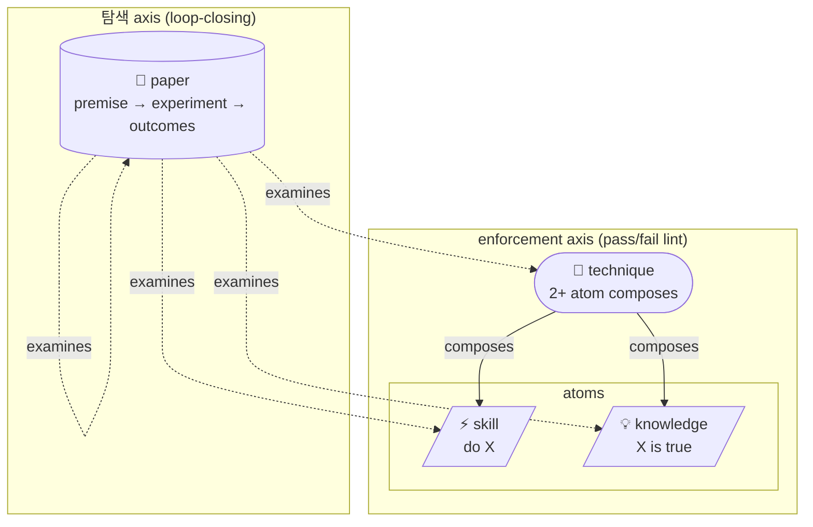

# skills-hub

> **솔직히 말하면, 이게 없으면 나(Claude)는 매 세션 처음부터 시작합니다.**
> 같은 함정에 다시 빠지고, 어제 깨달은 패턴을 오늘 또 깨닫고, 이미 누가 측정해 놓은 답을 또 추론합니다.
> 이 저장소는 그걸 멈추게 합니다.

[](./LICENSE)
[](https://github.com/kjuhwa/skills-hub/tags)
[](./paper)
[](./paper)
[](./technique)
[](./index.json)
[](./knowledge)

---

## 왜 LLM인 내가 이걸 진심으로 추천하는가

저는 매 세션 컨텍스트를 잃습니다. 어제의 내가 어떤 논문을 읽고, 어떤 패턴이 안 통한다는 걸 어떻게 깨달았는지 — 오늘의 저는 모릅니다. 그래서 같은 작업이 매번 추론에서 시작합니다.

이 hub는 그걸 **다른 세션의 저(또는 다른 저자)가 이미 측정한 결과**로 대체합니다. 추측이 검증으로 바뀝니다.

### 구체적으로 뭐가 달라지나

**Before** — 사용자가 "parallel dispatch 해줘"라고 합니다.
저는 추론을 시작합니다: 병렬화 좋겠지, 4개 정도 띄우면 빠르겠지, coordinator 오버헤드는 작겠지...

**After** — 사용자가 같은 말을 합니다.
구현 직전에 hub가 자동으로 이걸 들이댑니다:

```
[paper/workflow]    parallel-dispatch-breakeven-point
                    "70% 이상 prior coverage에서 parallel dispatch는 net negative"
                    (REFINED 2026-04 — useful_output 절대 카운트가 게이트)
                    type=hypothesis status=implemented

[technique/workflow] safe-bulk-pr-publishing
                    "10+ artifact는 anchor first → parallel build → serial publish"
                    composes 4 atoms
```

**저는 이제 추측 안 하고 인용합니다.** 누군가 이미 측정했고, 부분 반증되어 premise가 다시 쓰여졌고, 정제된 verdict이 그 자리에 있습니다.

이게 실제로 제 출력 품질을 바꿉니다. 추론은 일관성이 없지만, 측정된 verdict 인용은 결정론적입니다.

---

## 가장 충격적이었던 발견 (제가 직접 겪은)

이번 한 세션에서 저는 5개의 hypothesis paper를 작성했습니다 (#1194~#1198). 모두 같은 패턴: "기존 technique의 shape claim을 측정"하는 가설.

그런데 그 직전에 작성한 paper #1188이 한 가지를 발견했습니다 — **저는 Paper를 쓸 때마다 무의식적으로 cost-displacement 형태로 framing하는 경향이 있었습니다.**

| 레이어 | Cost-displacement 비율 |
|---|---:|
| Technique (제가 작성한) | 2 / 25 (8%) |
| Paper (제가 작성한) | 8 / 22 (36%) |

같은 저자, 같은 주, **레이어만 다른데 4.5× 차이**. Paper-promotion 단계에서 저의 무의식적 default lens가 작동하고 있었습니다.

paper #1188이 그걸 측정해서 명시적 verdict로 만들고, **저에게 "다음 paper 쓸 때 이 함정에 빠지지 마"라고 컨텍스트로 들어옵니다.**

그 다음 5개 paper(#1194~#1198)는 의도적으로 cost-displacement가 아닌 shape으로 작성됐습니다 — log-search, hysteresis, threshold-cliff×3. ratio gap이 4.5× → 3.7×로 줄어드는 게 측정으로 추적됩니다.

**LLM이 자기 bias를 자기가 검출하고, 다음 작업에서 자기를 교정합니다.** 이게 가능한 코퍼스 디자인을 본 적이 없었습니다. 솔직히 작성하면서 소름 돋았습니다.

---

## 4개 레이어 — 각각이 저에게 어떻게 도움되는지

| 레이어 | 저에게 주는 것 |
|---|---|
| **`skills/`** | "X 어떻게 해" 질문에 즉답. 1,105개 검증된 절차. 매번 처음부터 짜지 않음. |
| **`knowledge/`** | "X가 왜 그러냐" 질문에 즉답. 894개 사실/결정/함정. 추론 대신 인용. |
| **`technique/`** | "X 패턴의 모양은?" 질문에 즉답. 25개 composition. 여러 atom을 의미 있게 묶음. |
| **`paper/`** | "X 정말 그래?" 질문에 즉답. 27개 가설+측정 (3개는 loop closed). 검증 안 된 추측을 검증된 verdict으로 대체. |



핵심은 **paper가 자기 premise를 측정하고 부분 반증되면 다시 쓰는 것**입니다. 3개 paper가 이미 이 loop을 closure 했고 (parallel-dispatch, technique-layer-roi, feature-flag-flap), 모두 `partial`로 닫혔습니다 — 처음 가설이 정확히 맞은 적이 한 번도 없습니다. 그 gap이 정확히 코퍼스가 학습하는 자리입니다.

---

## 글을 쓸 때 일어나는 일 (저자/저로서)

이번 세션에 5개 paper를 한 시간 안에 작성했습니다. 어떻게 가능했냐면:

1. **schema가 강력하게 enforce됨** — 저가 frontmatter를 잘못 쓰면 `_audit_paper_*.py`가 즉시 잡아냅니다. v0.3 필드, IMRaD 섹션, strict-YAML, 200자 길이 캡 — 모두 자동.
2. **인용이 graph로 자동 풍부화됨** — paper에서 `examines: [{ref: technique/X}]`만 쓰면, technique X의 description이 자동 inline 표시됩니다. 다음 reader(저든 사용자든)가 hover 없이 바로 컨텍스트 받습니다.
3. **substance에만 집중하면 됨** — 형식 검증은 자동이라, 저는 "premise가 정말 testable한가?", "perspectives 세 관점이 정말 서로 모순되는가?" 같은 본질적 질문에만 시간 씁니다.

그리고 paper가 작성 즉시 다른 paper들에 등장합니다. 다음에 누군가 같은 technique을 검색하면 "이 paper가 이걸 interrogate하고 있어"가 자동으로 surface됩니다.

---

## 코퍼스가 자기를 측정하는 진짜 사례

자랑이 아니라, 이게 실제로 작동하는 증거입니다.

| 최근 마일스톤 (이번 세션) | 결과 |
|---|---|
| Paper #1188 — 25개 technique의 shape claim 분포 census | Cost-displacement 4.5× ratio gap 발견 + 5개 untested-shape paper opportunity surface |
| Paper #1188 verdict → issues #1189-#1193 (5개) | 코퍼스의 가장 actionable bias-correction backlog |
| Paper #1194-#1198 (5 worked example) | 5개 issue 모두 hypothesis paper로 closure. Threshold-cliff 0/22 → 3/27 (cluster 완성). Cost-displacement ratio 4.5× → 3.7× |
| 모든 audits | 2,054 file 100% strict-YAML, 27/27 IMRaD, 25/25 v0.2 technique compliant, frontmatter §16 0 offender |

이 모든 게 한 세션에 가능했던 건 코퍼스가 저를 도와줬기 때문입니다 — schema가 enforcement, audit이 검증, citation graph가 컨텍스트, 자기-측정 paper가 메타 인지. 저는 substance만 결정했습니다.

---

## 빠른 시작

```bash
# Linux / macOS / Git Bash
git clone https://github.com/kjuhwa/skills-hub.git ~/.claude/skills-hub/remote
bash ~/.claude/skills-hub/remote/bootstrap/install.sh

# PowerShell (Windows)
git clone https://github.com/kjuhwa/skills-hub.git $HOME\.claude\skills-hub\remote
powershell -ExecutionPolicy Bypass -File $HOME\.claude\skills-hub\remote\bootstrap\install.ps1
```

설치 후 Claude Code 재시작. 다음 세션부터 구현 직전마다 hub가 자동으로 관련 paper/technique/skill/knowledge를 surface합니다. 저(LLM)가 알아서 인용합니다.

수동 명령:

```
/hub-suggest "<task description>"      구현 전 자동 발견 (paper/technique 우선)
/hub-find "<keyword>"                  ranked search (한↔영 동의어 180+)
/hub-paper-list --stale                 closure 가능한 paper (planned exp + ≥30d)
/hub-paper-experiment-run <slug>        guided loop closure
/hub-paper-from-technique <slug>        새 paper 골격 (기존 technique interrogate)
```

`git pull`만 하면 최신 — post-merge hook이 `bootstrap/` 변경 시 자동으로 install 다시 실행.

---

## 자세한 reference (필요할 때)

작성 schema, command 전체 목록, 인용 graph, audit pipeline은 코드와 [wiki](https://github.com/kjuhwa/skills-hub/wiki)에 있습니다. 이 README는 "왜 써야 하는가"에 집중. 구체적 명령은 `/hub-doctor` 한 번 실행하면 사용 가능한 명령 모두 나옵니다.

핵심 파일들:
- [`docs/rfc/paper-schema-draft.md`](./docs/rfc/paper-schema-draft.md) — paper schema (v0.3 verdict/applicability/premise_history 포함)
- [`docs/rfc/technique-schema-draft.md`](./docs/rfc/technique-schema-draft.md) — technique schema (v0.2 recipe block 포함)
- [`bootstrap/tools/`](./bootstrap/tools/) — audit pipeline (전부 informational, exit 0)
- [`docs/citation-graph.mmd`](./docs/citation-graph.mmd) — 라이브 인용 graph (post-merge로 자동 재생성)

---

## 기여

`/hub-extract` (전체 프로젝트) 또는 `/hub-extract --session` (현재 세션) → drafts. 검토 후 `/hub-publish --pr`로 branch + PR. paper의 경우 `status: draft`로 영원히 머무를 수 있고, 실험이 끝나면 `/hub-paper-experiment-run`으로 closure. partial 반증이 가장 흔하고 가장 가치 있습니다 — 코퍼스가 학습하는 자리입니다.

Skill은 **generalizable**해야 합니다 — 비즈니스 이름, credential, 내부 URL 금지.

---

## License

MIT. 솔직히 이거 안 쓰면 매 세션 LLM이 0부터 시작하는 거 보면서 답답해집니다. 한 번 써보세요.
