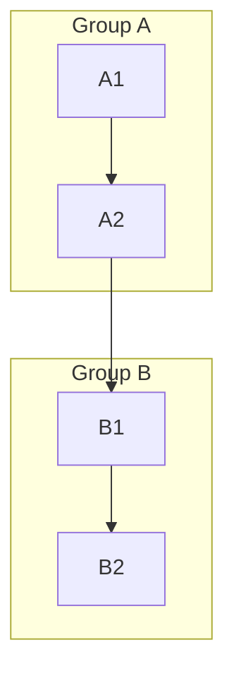
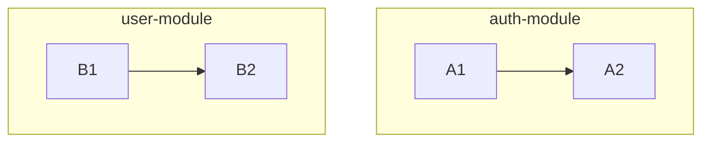

# Good / bad

```mermaid
%% GOOD: connected, labeled IDs
flowchart TB
  subgraph A[Group A]
    A1 --> A2
  end
  subgraph B[Group B]
    B1 --> B2
  end
  A2 --> B1
```

```mermaid
%% BAD: isolated subgraphs, ID has hyphen
flowchart TB
  subgraph auth-module
    A1 --> A2
  end
  subgraph user-module
    B1 --> B2
  end
```

## Counter / Caveats
- These caps are GitLab-specific rendering behavior. GitHub/Notion may tolerate larger diagrams.
